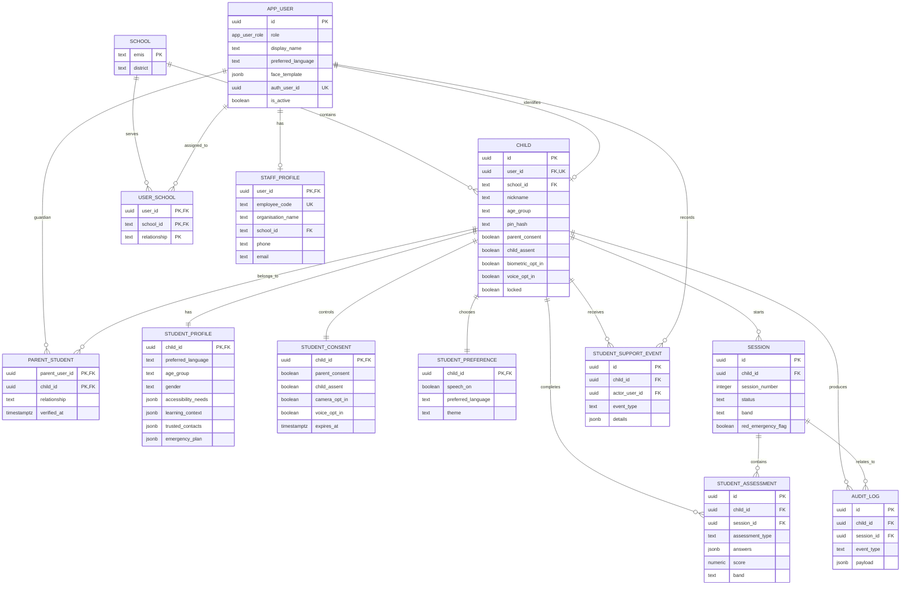

# ARAM PostgreSQL ERD

This is the testing-phase data model. Apply migrations in numeric order:

1. `supabase/migrations/0001_init.sql`
2. `supabase/migrations/0002_user_roles_and_student_details.sql`



## Privacy boundaries

- `child` stores a nickname and coarse age group, never a date of birth or legal name.
- `app_user.face_template` stores a face descriptor only; captured photos are not stored.
- Student assessment answers and support details are JSONB so the schema can evolve, but access must remain behind audited RPCs.
- All application tables have RLS enabled. The browser should use RPCs rather than direct table access.
- `auth_user_id` is reserved for the eventual Supabase Auth identity; passwords should not be stored in these tables.

## Local testing

```bash
docker compose up -d
# PostgreSQL is available at localhost:5432
# database: aram, user: aram, password: aram-local-only

docker compose down
```

The initialization scripts run only when the `aram-postgres-data` volume is first created. To
re-run migrations from a clean database during testing:

```bash
docker compose down -v
docker compose up -d
```
